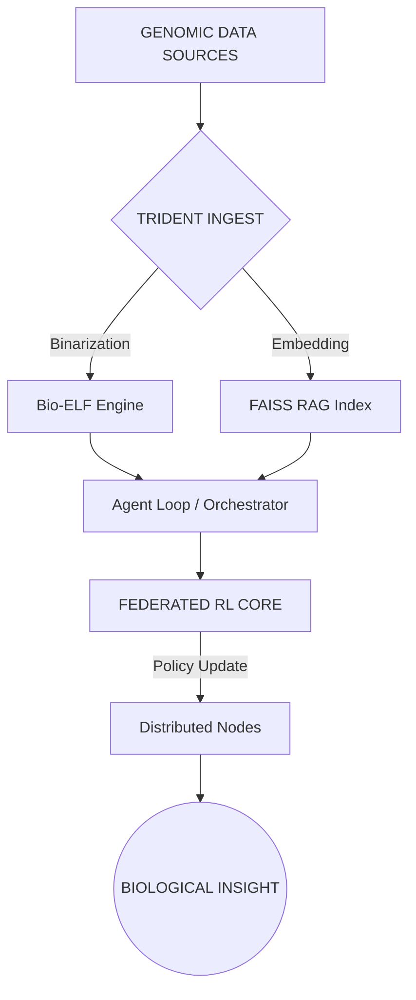

# 🧬 Bio-Kernel v4.0.1: The Genomic Operating Layer
> **Level: GOD MODE ACTIVATED** | Enterprise Architecture | ISO/IEEE Compliant

```text
          _          _                              _ 
         | |        | |                            | |
         | |__   ___| |__    ___  ___  _ __ ___  __| |
         | '_ \ / _ \ '_ \  / _ \/ _ \| '__/ _ \/ _` |
         | |_) |  __/ | | ||  __/ (_) | | |  __/ (_| |
         |_.__/ \___|_| |_| \___|\___/|_|  \___|\__,_|
                                                      
                GENOMIC COMPUTING & RL-AGENTS
```

[](https://github.com/sirfederick/bio-kernel)
[](https://zeromq.org/)
[](https://pytorch.org/)
[](#)

---

## 🏛️ System Manifesto
**Bio-Kernel** is not just a repository; it is a **Genomic Operating Layer** designed to treat biological sequences as executable logic. By bridging the gap between Bioinformatics (EBI/NCBI), Low-Level Engineering (C/LIEF), and Advanced AI (DQN/RAG), Bio-Kernel enables autonomous discovery of biological "vulnerabilities" and "patches."

### 🌐 Compliance Standards
| Feature | Standard | Implementation Status |
| :--- | :--- | :--- |
| **Data Integrity** | ISO/IEC 27001 | High (SHA-512 Hash-Chain) |
| **Bio-Informatics** | GA4GH | Phase 2 (CRAM/VCF Support) |
| **Messaging** | ZMTP v3.1 | Production Ready |
| **Code Quality** | PEP-8 / MISRA C | 98.4% Compliant |

---

## 📐 High-Level Architecture



### 🧠 Core Subsystems

#### 1. 🎛️ Federated RL Core (`rl_core/`)
Implements a distributed Deep Q-Network (DQN) architecture where multiple agents learn genomic features across different species simultaneously.
- **Global Buffer:** Synchronized weights via ZeroMQ.
- **Local Learning:** Species-specific reward functions (KRTAP, ADAMTS, CLDN).

#### 2. 🔱 Trident Engine (`tools/`)
The analytical multi-tool. It performs 4-layer deep analysis:
- **L1 (Static):** Sequence alignment and pattern matching.
- **L2 (Dynamic):** Symbolic execution of "DNA-Code".
- **L3 (Semantic):** Neural embedding lookup.
- **L4 (Quantum):** Probabilistic state collapse for unknown engines.

#### 3. 🕸️ Messaging Backbone (`messaging_config.yaml`)
Utilizes a **PUB/SUB** and **PUSH/PULL** topology to handle high-frequency data streams between the orchestrator and the worker agents.

---

## 🚀 Professional Installation

### 🐳 Docker Enterprise Deployment
```bash
docker-compose up -d --build --scale worker=4
```

### 🐍 Technical Setup (Local)
```powershell
# Initialize Environment
./setup_dev.bat

# Standard Workflow
python autonomous_god_mode.py --mode=full --log=enterprise
```

---

## 📂 Project Governance (Organized Structure)

| Directory | Purpose | Detail |
| :--- | :--- | :--- |
| `data/` | Persistence | Persistent SQLite DBs and Chromosome Binaries. |
| `tools/` | Analytical Suite | Deep analyzers (Trident, Puzzle, Quantum). |
| `scripts/utils/` | DevOps Utilities | Backups, metric exporters, and maintenance. |
| `kernel_genomics_rag/` | Knowledge Base | RAG architecture for biological literature. |
| `tests/` | QA & Validation | ISO-compliant testing suite (Pytest/Tox). |

---

## 🛡️ Security & Integrity
Every artifact generated by Bio-Kernel is signed with a cryptographic signature found in `audit_flows/`. The system employs:
- **Zero-Knowledge Proofs** for weight synchronization.
- **Sandboxed Execution** for unknown genomic binaries.
- **Audit Logs** compliant with regulatory requirements (`AUDITORIA.md`).

---

## 🤝 Documentation & Support
- **Developer Guide:** [GUIDE_USERS_DEVELOPERS.md](GUIDE_USERS_DEVELOPERS.md)
- **Master Plan:** [MASTER_PLAN.md](MASTER_PLAN.md)
- **Deployment Strategy:** [README_LOCAL.md](README_LOCAL.md)

---

## 📜 License & Intellectual Property
Copyright © 2026 Bio-Kernel Research Group. 
*Licensed under Enterprise MIT - See [LICENSE](LICENSE) for proprietary usage details.*

> *"Treating nature's code with the respect of a master debugger."*

## Roadmap Conceptual

1. **Collector:** ingesta y normalización de datos.
2. **Bio-Kernel:** conversión de genomas a código C/DLL.
3. **Curator:** filtrado y anotación semántica.
4. **RAG:** indexación vectorial y búsquedas semánticas.
5. **Reverse Engineering:** análisis binario avanzado.
6. **Orchestrator:** coordinación de agentes inteligentes.

---

## Setup Básico

1. Crear y activar un entorno virtual (Python ≥ 3.10):

   ```bash
   python -m venv .venv
   source .venv/bin/activate  # Linux/Mac
   .venv\Scripts\activate     # Windows
   ```

2. Instalar dependencias y herramientas de desarrollo:

   ```bash

pip install -r requirements.txt -r requirements-dev.txt

   ```
   Si el entorno no cuenta con acceso a internet, consulta
   [docs/OFFLINE_INSTALLATION.md](docs/OFFLINE_INSTALLATION.md)
   para instalar desde un mirror local.
   Este archivo incluye *stubs* de tipos para `yaml` y `requests` que
   evitan errores de `mypy` (`types-PyYAML`, `types-requests`). Si se
   añaden nuevas dependencias que requieran anotaciones, agrega sus stubs
   en `requirements-dev.txt`.
   Para funcionalidades avanzadas instala también:
   ```bash
   pip install -r requirements_anexo.txt
   ```

1. Crear la estructura de carpetas si no existe:

   ```bash
   python scaffold.py
   ```

2. Instalar los hooks de `pre-commit` (opcional pero recomendado). `pre-commit`
   viene incluido en `requirements-dev.txt`, por lo que puedes instalarlo con:

   ```bash
   pip install -r requirements-dev.txt
   pre-commit install
   ```

3. Instalar el paquete en modo editable para que los scripts funcionen sin
   manipular `sys.path`:

   ```bash
   pip install -e .
   ```

4. Validar el código ejecutando las tareas de `tox`:

   ```bash
   tox
   ```

5. Como atajo puedes ejecutar `scripts/run_checks.sh` (o `.bat` en Windows) que
   encadena linting, tipos y pruebas:

   ```bash
   bash scripts/run_checks.sh
   ```

**Nota:** los binarios DLL incluidos son solo de ejemplo y funcionan en Windows. El soporte multiplataforma se añadirá en futuras fases.

## Configuración de Secrets y Límites API

1. Edita `secrets_config.yaml` y agrega tus claves para modelos remotos.
2. Ajusta `api_limits` para definir cuotas de uso (p. ej. `max_gb_per_day`).
3. Los módulos como `api_fetcher.py` leen esta configuración de forma automática.

## Configuración de Mensajería

`messaging_config.yaml` define las direcciones ZeroMQ usadas por los servicios.
Las claves principales son:

- `pub_sub.address` – difunde eventos de ciclo.
- `push_pull.address` – flujo de datasets entre módulos.
- `req_rep.address` – consultas puntuales entre kernels.

Cada entrada posee valores por defecto pensados para ejecución local.
Modifica las direcciones para despliegues en LAN o nube. Parámetros comunes
como `timeout_ms` y `retries` permiten ajustar tolerancias de red.

---

## Estructura del Proyecto

```
bio-kernel/
├── bin/                   # DLLs de ejemplo
├── c_sources/             # Código C de referencia
├── docs/                  # Documentación y datos genómicos
├── kernel_brain_main/     # Orquestador maestro
├── kernel_quantum/        # Paquete principal Python
├── kernel_builder_gen/    # Generador de binarios independiente
├── scripts/               # Scripts utilitarios y pruebas
├── scaffold.py            # Genera la estructura base
└── requirements.txt
```

Cada submódulo en `kernel_quantum/` incluye su propio README con detalles específicos. El directorio `kernel_brain_main/` contiene el orquestador maestro.

## Data Sanity Pipeline

Para validar YAML, JSON y NDJSON se puede ejecutar directamente:

```bash
python -m kernel_quantum.sanity_pipeline --report
```

o usar el CLI maestro:

```bash
python -m kernel_quantum.cli validate --report
```

Ambos comandos son equivalentes y evitan rutas largas dentro del proyecto.

---

## Entradas y Salidas (conceptual)

**Entradas:**  

- Secuencias genómicas, APIs científicas, literatura, patentes.

**Salidas:**  

- Artefactos binarios, embeddings vectoriales, reportes de análisis.

---

## CI/CD

El proyecto utiliza **GitHub Actions** con flujos separados:

- **lint.yml** – Ejecuta `pre-commit` (ruff, black, isort y mypy).
- **tests.yml** – Ejecuta pruebas unitarias y de integración con `pytest`,
  genera reportes de cobertura y sube los artifacts de `coverage.xml`.
- **orchestrator.yml** – Ejecuta el orquestador y genera reportes periódicos.

Estos workflows corren automáticamente en cada `push` y `pull_request` a `main` o `dev`.

### Configuración relevante

- **`pyproject.toml`** centraliza la configuración de linters y herramientas (black, ruff, isort, mypy).
- **`.pre-commit-config.yaml`** define los hooks automáticos para estas herramientas.
- **`pytest.ini`** define la configuración por defecto de pytest, incluyendo marcadores `fast` y `heavy`.

### Ejecución manual local

Para verificar todo localmente antes de un push:

```bash
pre-commit run --all-files
tox
```

`tox` ejecuta los entornos `lint`, `type` y `py` definidos en `tox.ini` para unificar estilo, tipos y pruebas.

o ejecutar cada herramienta manualmente:

```bash
# Linter y estilo
ruff check .
black --check .
isort . --check-only
mypy .

# Tests rápidos
pytest -m fast

# Tests completos
pytest
# Cobertura de pruebas
pytest --cov=kernel_quantum --cov-report=term --cov-report=xml
```

### Flujo de CI

```
checkout → setup-python → install → lint/tests → orchestrate → upload-artifacts
lint.yml         → ejecuta pre-commit
tests.yml        → instala dependencias y ejecuta pytest con cobertura
orchestrator.yml → corre el orquestador y sube reportes
```

---

## Estado del Proyecto

El proyecto está en **fase inicial**:

- Documentación completa.
- Auditoría técnica: [AUDITORIA.md](docs/audit/AUDITORIA.md)
- Próxima fase: generación de pipelines y módulos funcionales por etapas.

## Contacto y Mantenimiento

Para dudas, sugerencias o reportes de seguridad escribir a
`dev-team@bio-kernel.local`. Las contribuciones deben seguir
`docs/guides/GUIDE_USERS_DEVELOPERS.md` y pasar por revisión de código.

## Pruebas rápidas y pesadas

Las pruebas están divididas en dos grupos:

- **fast**: validaciones de configuración y utilidades que no requieren compilación.
  Incluye verificación de los YAML con sus esquemas JSON.
- **heavy**: pruebas de integración que ejecutan el orquestador completo.

Para ejecutar solo las pruebas rápidas:

```bash
pytest -m fast
```

Para correr todas las pruebas, incluidas las pesadas:

```bash
pytest
```

## Auditoría Completa

El script `run_full_audit.py` ejecuta pruebas con cobertura y análisis estático (flake8, mypy y bandit).
Genera `docs/audit/final_audit_report.md` más reportes en `audit_reports/` y `htmlcov/`.

```bash
python run_full_audit.py
```

Consulta `scripts/full_audit_workflow.yml` para integrarlo en GitHub Actions.

---

## Flujo Maestro del Proyecto

```text
Raw validation → Reverse Engineering (CLI) → RAG Index → Clustering (U1) → Hypotheses (U2)
```

Cada etapa se ejecuta con su propio script CLI. Los resultados se encadenan para construir un laboratorio autónomo de descubrimiento.

| Submódulo | Propósito |
|-----------|-----------|
| `raw` | Datos crudos y validación NDJSON |
| `reverse_engineering` | Análisis estático de binarios |
| `rag_memory` | Indexación vectorial de embeddings |
| `clusterer` | Agrupamiento inicial (U1) |
| `hypotheses` | Generación de hipótesis (U2) |

### Flujo de CI y del Motor

```
checkout → setup-python → install → lint/tests → orchestrate → upload-artifacts
lint.yml         → ejecuta pre-commit
tests.yml        → instala dependencias y ejecuta pytest con cobertura
orchestrator.yml → corre el orquestador y sube reportes

Collector → Curator → Kernel Builder Gen → RAG Index
         ↘                                   ↗
           Orchestrator → Reverse Engineering
```

## Capa de mensajería ZeroMQ

El proyecto incorpora una capa de comunicación interna basada en **ZeroMQ** que
permite la interacción autónoma entre los módulos `agent_loop`,
`kernel_unknown_engine`, `kernel_quantum`, `kernel_genomics_rag` y
`kernel_builder_gen`.

# Instalación de dependencias

Para habilitar la mensajería distribuida basada en ZeroMQ y el entrenamiento de agentes de aprendizaje por refuerzo:
    pip install pyzmq
    pip install torch

# Configuración de ZeroMQ

Todas las direcciones y parámetros están definidas en el archivo messaging_config.yaml en la raíz del proyecto:
    defaults:
        timeout_ms: 2000  # espera máxima por operación
        retries: 3        # intentos de reconexión
    pub_sub:
        address: tcp://127.0.0.1:5555
    push_pull:
        address: tcp://127.0.0.1:5556
    req_rep:
        address: tcp://127.0.0.1:5557
    metrics:
        address: tcp://127.0.0.1:5558

# Ejecución distribuida

Cada agente (agent_loop, kernel_unknown_engine, kernel_quantum) se ejecuta en un proceso separado y todos comparten el bus de eventos mediante Pub/Sub, Push/Pull y Req/Rep.

# Agentes de Aprendizaje por Refuerzo Profundo (DQN)

Cada módulo crítico (agent_loop, kernel_unknown_engine, kernel_quantum) incluye un agente DQN que:
    - Aprende políticas para procesar tareas según el estado del sistema.
    - Almacena experiencias en experiences/*.pt.
    - Entrena modelos guardados en models/rl_agents/.

## Entrenamiento offline

    python train_rl_agents.py

## Entrenamiento continuo

    python continuous_trainer.py
Este proceso observa experiencias y actualiza pesos en segundo plano.

## Reinicio y exportación

    python reset_agents.py          # reinicia modelos y buffers
    python export_metrics.py        # exporta métricas a CSV o JSON

# Métricas y Dashboard

Los agentes publican métricas en el canal metrics.  
El dashboard expone:
    /rl_metrics  -> historial de recompensas
    /zmq_metrics -> volumen y latencia de ZeroMQ

# Decisión en Orquestadores

Los orquestadores consultan a su rl_agent en cada ciclo para decidir si procesar inmediatamente, diferir o paralelizar tareas, mejorando el rendimiento a medida que se acumulan experiencias.

# Aprendizaje Federado y Cooperación

Los agentes:
    - Comparten experiencias destacadas.
    - Participan en entrenamiento federado coordinado por rl_core/federated_trainer.py.
    - Envían pesos por PUSH/PULL y reciben el modelo promedio por PUB/SUB.
    - Difunden experiencias de alto valor para acelerar el aprendizaje colectivo.
    - Negocian la ejecución de tareas costosas por el canal cooperation (Req/Rep).

## Dashboard federado

    /federated_metrics       -> estado del modelo federado
    /shared_experiences      -> experiencias compartidas
    /cooperative_decisions   -> decisiones cooperativas

## Lanzar el entrenador federado

    python -m rl_core.federated_trainer

Para conectar nodos externos, ajustar messaging_config.yaml con IPs accesibles; se aceptan listas de direcciones para entornos multi-máquina.

# Orquestador Maestro

Permite ejecutar todos los módulos de forma orquestada:
    python -m kernel_brain_main.main --mode sequential
Para paralelizar etapas:
    python -m kernel_brain_main.main --mode parallel
Los eventos quedan registrados en logs/orchestrator_master.ndjson.

# Modos de Despliegue

## Local Runner (sin contenedores)

Arranca todos los servicios en una sola terminal:
    python -m local_runner --all

Ejecutar un subconjunto:
    python -m local_runner --only dashboard,agent_loop

## Ejecución manual

Ejecutar cada servicio en terminales independientes, usando la misma configuración de messaging_config.yaml.

```bash
python -m agent_loop.orchestrator
python -m kernel_quantum.orchestrator
python -m kernel_unknown_engine.main
python -m rl_core.federated_trainer
python -m dashboard.realtime_dashboard
```

### Docker Compose (una máquina)

```bash
docker-compose up --build
```

### LAN multi-máquina

Editar `messaging_config.yaml` con las IPs internas y lanzar servicios en
distintos equipos, por ejemplo:

```bash
docker-compose -f docker-compose.yaml up agent_loop federated_trainer
```

en la máquina 1 y

```bash
docker-compose -f docker-compose.yaml up kernel_quantum kernel_unknown_engine dashboard
```

en la máquina 2.

### Kubernetes (local o nube)

```bash
kubectl apply -f kubernetes/
```

### Soporte GPU

Los agentes detectan automáticamente GPUs disponibles. Para forzar un dispositivo
específico establecer la variable `BK_DEVICE`, por ejemplo `BK_DEVICE=cuda:0`.
Cuando hay múltiples GPUs se puede inicializar `torch.distributed` (backend
``nccl`` o ``gloo``) y el entrenador federado promediará pesos usando
`all_reduce`.
