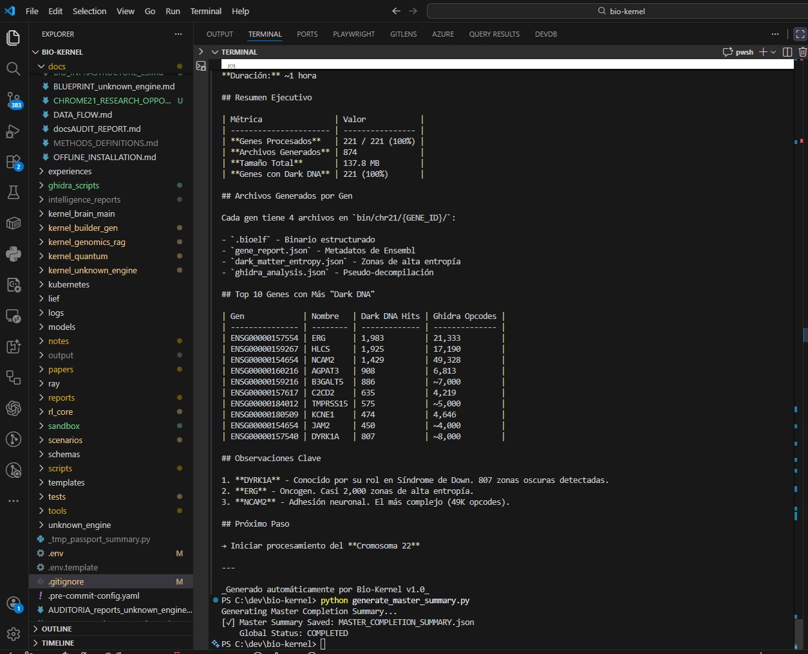
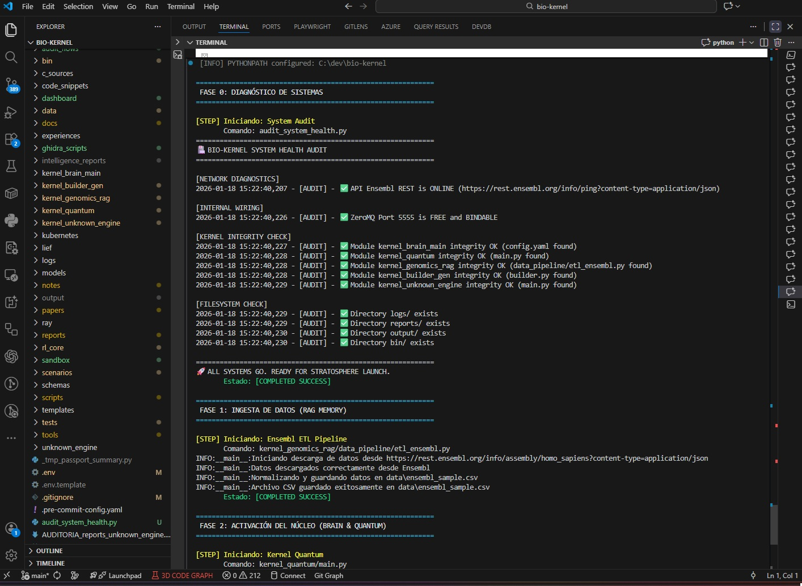

# Building an audit-friendly genome scanner (what it *is* and what it’s *not*)

> **Hero image idea (AI prompt):** “Professional photo: human eye, iris as data streams + subtle DNA motif, blue/gold, high contrast.”

Bio‑Kernel is an open-source pipeline that treats genomic sequences as a **reproducible data product**: ingest → represent → mine → validate → export artifacts.

<!-- INTERNAL IMAGE SLOT (LinkedIn) #1
File: ../Imagenes/loggin_geenral con menu.jpg
Why here: establishes product surface (dashboard) immediately.
Suggested caption: "Dashboard view: pipeline surface + navigation (operational visibility, not biological claims)."
Suggested markdown:

-->

**Safe default:** Bio‑Kernel prioritizes recurrent signatures under a defined representation (tokenization + null tests); functional interpretation is out of scope and requires orthogonal validation.

## What exists today (verifiable)

- Coverage snapshot (2026‑01‑17): chromosomes 20/21/22 processed; **958 genes**.
- Validation parameters: **$n=8$**, **$N=1000$** permutations; **76 evaluated patterns**; **18 survivors** under block-shuffle.
- Triage output: **198** passport rows (**193** unique loci) with stability labels and q-values.

<!-- INTERNAL IMAGE SLOT (LinkedIn) #2
File: ../Imagenes/resumen_final.jpg
Why here: pairs well with the “What exists today” bullets as a proof-of-artifacts snapshot.
Suggested caption: "Executive outputs snapshot: reports + catalogs generated by the current run artifacts."
Suggested markdown:

-->

## Transparent boundary

- Evidence is in `reports/` artifacts.
- Any LLM-assisted text must be treated as narrative unless backed by those artifacts.

<!-- INTERNAL IMAGE SLOT (LinkedIn) #3
File: ../Imagenes/00_Check-list_preLaunch.jpg
Why here: reinforces governance/reproducibility boundary in a single visual.
Suggested caption: "Pre-launch checklist: what gets pinned per run (scope, artifacts, reproducibility gates)."
Suggested markdown:

-->

I’m looking for collaborators who enjoy reproducible pipelines, stronger null models, and confounder controls (repeats/segdups/mappability).

Version pin for this draft: commit `44e83d1e82725cccb930a4a35d5596cc9e5d4f15`.

#Innovation #Python #Bioinformatics #Reproducibility
