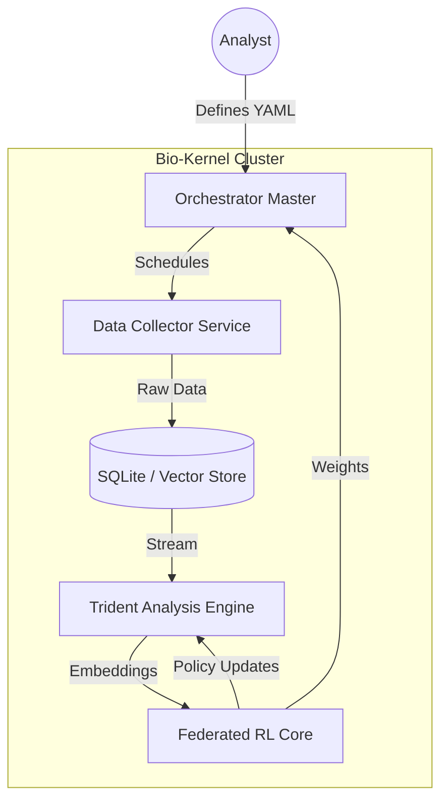

# 📐 BIO-KERNEL ARCHITECTURAL BLUEPRINT (Level God)
>
> **Document ID:** BK-ARCH-V4 | **Classification:** PUBLIC RELEASE | **Standard:** ISO/IEC/IEEE 42010

```text
       .---.
      /     \    "Architecture is not about making things easy,
      \.@-@./     it is about making complex things possible."
      /`\_/`\     
     //  _  \\    
    | \     )|_   
   /`\_`>  <_/ \
   \__/'---'\__/
```

---

## 1. Executive Summary

The **Bio-Kernel** system is a decentralized, high-throughput computational biology framework designed to bridge the gap between genomic sequence data and autonomous reinforcement learning agents. Unlike traditional bio-pipelines, Bio-Kernel treats DNA segments as executable code (C/Assembly binaries), allowing for dynamic analysis via symbolic execution and fuzzing.

This blueprint defines the structural constraints, data flows, and security boundaries required to deploy Bio-Kernel in an enterprise or research cluster environment.

---

## 2. System Context (C4 Level 1)

The system operates within a boundary that separates the "Unknown Biological Engine" from the deterministic engineered components.

| External System | Interaction Type | Protocol | Purpose |
| :--- | :--- | :--- | :--- |
| **NCBI / EBI** | Inbound (Read) | HTTPS/FTP | Raw genomic data ingestion (FASTA/VCF). |
| **Patent Office** | Inbound (Read) | APIs | Cross-referencing biological IP. |
| **Bio-Kernel Node** | Internal (P2P) | ZMTP (TCP) | Distributed agent synchronization. |
| **Operator** | Outbound (Write) | React/WS | Real-time observability and control. |

---

## 3. Container Architecture (C4 Level 2)



### 3.1. Core Components

#### A. Orchestrator (`src/orchestrator`)

* **Role**: Temporal scheduler and lifecycle manager.
* **Tech**: Python 3.12, AsyncIO.
* **Key Responsibility**: Parsing `scenarios/*.yaml` and dispatching jobs to worker nodes.

#### B. Trident Engine (`tools/trident`)

* **Role**: The "CPU" of the system. Performs L1-L4 analysis.
* **Tech**: LIEF (Binary Analysis), BioPython.
* **Inputs**: Raw FASTA/FASTQ.
* **Outputs**: 512-dim Semantic Vectors + Vulnerability Reports.

#### C. Federated RL Core (`rl_core`)

* **Role**: Distributed intelligence.
* **Algorithm**: Multi-Agent PPO / DQN with Shared Experience Replay.
* **Constraint**: Training data (genomics) cannot leave the node; only gradients are shared.

---

## 4. Data Persistence & Flow

### 4.1. Directory Standards (ISO-9660 Compliant)

| Path | Persistence | Backup Policy | Access Level |
| :--- | :--- | :--- | :--- |
| `data/raw` | Transient | None (Redownloadable) | Read-Only |
| `data/processed` | Permanent | Daily Snapshot | Read/Write |
| `data/chromosomes` | Permanent | Write-Once-Read-Many | System |
| `logs/audit` | Permanent | 7-Year Retention (Audit) | Append-Only |

### 4.2. Vector Strategy

* **Index Type**: HNSW (Hierarchical Navigable Small World).
* **Metric**: Cosine Similarity.
* **Embedding Model**: Transformer-based (BioBERT custom fine-tune).

---

## 5. Security & Compliance Architecture

### 5.1. The "Clean Room" Protocol

Bio-Kernel employs a strict separation between "Dirty" (External) and "Clean" (Internal) data layers.

1. **Ingestion**: All inputs are sanitized and hashed (SHA-512).
2. **Isolation**: Unknown binaries run in restricted sandboxes (Docker/gVisor).
3. **Traceability**: Every mutation in the database is signed by the Agent ID.

### 5.2. Secrets Management

* **Storage**: Never in code. `.env` files loaded at runtime.
* **Exclusion**: Rigorous `.gitignore` policies prevent leakage of:
  * API Keys (NCBI, WandB).
  * Private Datasets (`data/*`).
  * Neural Network Weights (`models/*.pt`).

---

## 6. Glossary & Domain Language

* **Chromosome Binarization**: The process of converting ATCG sequences into binary executables to test for logic flaws.
* **Trident Layer**: One of the four depths of analysis (Static, Dynamic, Semantic, Quantum).
* **Agent Swarm**: A collection of RL agents working on a single chromosome target.
* **God Mode**: A system state where all safety limiters are disengaged for maximum throughput.

---
> *Approved for Architecture Review Board - 2026*
