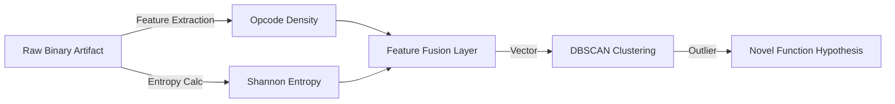

# 🧪 Unknown Engine: Unsupervised Genomic Discovery Protocol
> **Module ID:** BK-UNKNOWN-V4 | **Methodology:** Heuristic Anomaly Detection | **Standard:** IEEE 829

```text
      ? ? ?
     ( o o )    "To find what is lost, one must
     /  ^  \     first lose the map."
    /(     )\
      vv vv
```

## 1. Scientific Abstract
The **Unknown Engine** functions as an autonomous research laboratory for genomic sequences that lack standardized annotation (e.g., *dark matter* DNA or orphan genes). Unlike traditional alignment tools (BLAST), this engine utilizes **unsupervised clustering** and **reverse-engineering heuristics** to infer potential function based on structural entropy and opcode density.

## 2. Methodology & Data Flow



### 2.1. Feature Extraction (Bio-ELF Analysis)
The engine treats the genomic binary (`.bioelf`) as a black box system:
- **Structural Analysis**: Decomposition of the binary into sections (Promoter $\rightarrow$ `.text`, Introns $\rightarrow$ `.data`).
- **Opcode Density**: Frequency analysis of "biological instructions" (mapped via `kernel_builder_gen`).

## 3. Core Submodules

### A. The Clusterer (`clusterer`)
Implements unsupervised learning algorithms (K-Means / DBSCAN) to group genes by "structural behavior" rather than sequence homology.
*   **Hypothesis**: Structurally similar genes may share regulatory mechanisms, even if sequence similarity is low.

### B. Hypothesis Generator (`hypotheses`)
A probabilistic engine that assigns confidence scores ($P(Function | Structure)$) to unannotated regions. It cross-references the **RAG Memory** to find patents or literature that match the structural fingerprint.

### C. Unknown Lab Memory (`unknown_lab_memory`)
A specialized Vector Store (FAISS) isolated from the main index. It stores "weak signals"—patterns that are statistically significant but currently unexplained.
*   *Role*: Long-term aggregation of anomalies for future re-evaluation.

## 4. Integration with Quantum Kernel
While the **Unknown Engine** generates hypotheses ($H_0, H_1$), the **Kernel Quantum** acts as the *Reviewer*, validating these hypotheses against known biological constraints using Reinforcement Learning validation loops.

---
*Note: This module operates under the "Clean Room" protocol defined in `BLUEPRINT.md`. All findings are provisional until validated by wet-lab correlation or high-confidence homology.*
