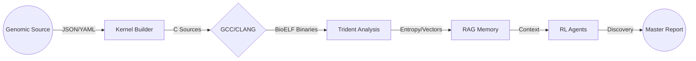

# 🔄 Bio-Kernel Data Flow Specification
> **Document ID:** BK-FLOW-V4 | **Classification:** PUBLIC RELEASE | **Standard:** ISO/IEC 19505 (UML)

```text
      .-->.     .-->.
     /     \   /     \    "Data is the blood of the system,
    |  (0)  | |  (1)  |    Latency is the blockage."
     \     /   \     /
      '--''     '--''
```

## 1. Global Data Topology

The system operates on a **unidirectional acyclic graph (DAG)** of data transformation. High-throughput sequencing data flows from raw ingestion to semantic embedding without retro-causality.



---

## 2. Module Interactions & Artifacts

### 2.1. Kernel Builder Gen (`kernel_builder_gen`)
**Role:** The primary ingestion and compilation factory.
*   **Input Stream:** Configured Genome YAMLs from `kernel_builder_gen/config.yaml`.
*   **Transformation:**
    *   Sequence $\rightarrow$ `c_sources/*.c`
    *   Compilation $\rightarrow$ `bin/*.dll` (Bio-ELF)
*   **Output Stream:**
    *   `bin/metadata/*.json`: Structural metadata (Promoter locations).
    *   `reports/unknown_genes.ndjson`: Anomalies with `unknown_score > 0.8`.

### 2.2. Kernel Quantum Orquestrator (`kernel_quantum`)
**Role:** The central nervous system for task delegation.
*   **Input Stream:** `unknown_genes.ndjson` (Anomaly Feed).
*   **Process:** Aggregates distributed agent states via ZeroMQ.
*   **Output Stream:**
    *   `reports/master_report.json`: The "State of the Genome" consolidated view.

### 2.3. Genomics RAG (`kernel_genomics_rag`)
**Role:** Semantic Memory Bank.
*   **Input Stream:** `data/ensembl_sample.csv` (Reference Data).
*   **Output Stream:**
    *   `data/faiss.index`: Dense Vector Index (HNSW).
    *   `data/texts.json`: Textual metadata mapping.

### 2.4. Unknown Engine (`kernel_unknown_engine`)
**Role:** Deep Space Discovery.
*   **Input Stream:** `unknown_genes.ndjson` (Filtered for high entropy).
*   **Output Stream:**
    *   `clusterer/clusters.ndjson`: Unsupervised DBSCAN groups.
    *   `hypotheses/hypotheses.ndjson`: Generated scientific hypotheses.

```json
// Sample Artifact: Unknown Summary
{
  "gene_id": "GENE_X99",
  "unknown_score": 0.98,
  "cluster_id": 4,
  "hypothesis": "Non-coding RNA scaffolding",
  "p_value": 0.004
}
```

---

## 3. Storage Hierarchy
Data persistence adheres to strict immutability rules for auditability.

| Data Stage | Format | Persistence Policy |
| :--- | :--- | :--- |
| **Level 0 (Raw)** | FASTA/FASTQ | Transient (Cache) |
| **Level 1 (Binary)** | .BioELF | Permanent (Artifact Store) |
| **Level 2 (Vector)** | FAISS/Pickle | Ephemeral (Rebuildable) |
| **Level 3 (Insight)** | NDJSON | Append-Only (Audit Trail) |

---
> *Status: Verified Schema v4.0.1*
