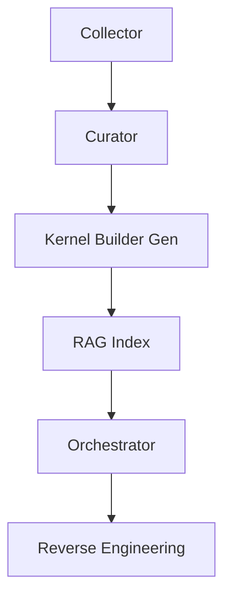

# Arquitectura Bio-Kernel

Este diagrama resume el flujo principal entre módulos. Cada etapa genera artefactos
que alimentan a la siguiente. Los detalles completos se encuentran en los README
individuales de cada submódulo.
